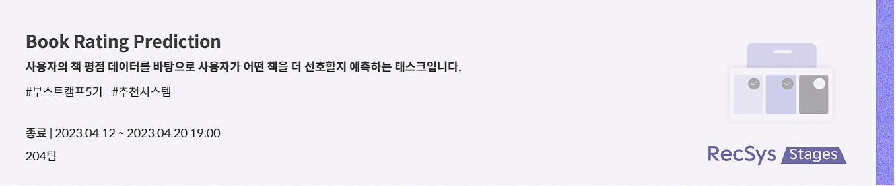
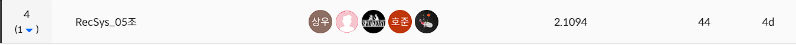

# level1_bookratingprediction-recsys-05

&nbsp;
### RecSys_5조

&nbsp;

### 🥈 최종 결과



&nbsp;

## 🙋🏻‍♂️🙋🏻‍♀️  Member
<table align="center">
  <tr height="155px">
    <td align="center" width="150px">
      <a href="https://github.com/ghwns82"></a>
    </td>
    <td align="center" width="150px">
      <a href="https://github.com/dhkim77000"></a>
    </td>
    <td align="center" width="150px">
      <a href="https://github.com/sangwu99"></a>
    </td>
    <td align="center" width="150px">
      <a href="https://github.com/y2r1m"></a>
    </td>
    <td align="center" width="150px">
      <a href="https://github.com/AI-soyoung"></a>
    </td>
  </tr>
  <tr height="80px">
    <td align="center" width="150px">
      <a href="https://github.com/ghwns82">이호준_T5168</a>
    </td>
    <td align="center" width="150px">
      <a href="https://github.com/dhkim77000">김동환_T5028</a>
    </td>
    <td align="center" width="150px">
      <a href="https://github.com/sangwu99">박상우_T5081</a>
    </td>
    <td align="center" width="150px">
      <a href="https://github.com/y2r1m">박예림_T5088</a>
    </td>
    <td align="center" width="150px">
      <a href="https://github.com/AI-soyoung">임소영_T5172</a>
    </td>
  </tr>
</table>
&nbsp;

## 🖼️ Project Overview

일반적으로 책 한 권은 원고지 기준 800~1000매 정도 되는 분량을 가지고 있습니다.

뉴스기사나 짧은 러닝 타임의 동영상처럼 간결하게 콘텐츠를 즐길 수 있는 ‘숏폼 콘텐츠’는 소비자들이 부담 없이 쉽게 선택할 수 있지만, 책 한권을 모두 읽기 위해서는 보다 긴 물리적인 시간이 필요합니다. 또한 소비자 입장에서는 제목, 저자, 표지, 카테고리 등 한정된 정보로 각자가 콘텐츠를 유추하고 구매 유무를 결정해야 하기 때문에 상대적으로 선택에 더욱 신중을 가하게 됩니다.

해당 경진대회는 이러한 소비자들의 책 구매 결정에 대한 도움을 주기 위한 개인화된 상품 추천 대회입니다.

책과 관련된 정보와 소비자의 정보, 그리고 소비자가 실제로 부여한 평점, 총 3가지의 데이터 셋(users.csv, books.csv, train_ratings.csv)을 활용하여 이번 대회에서는 각 사용자가 주어진 책에 대해 얼마나 평점을 부여할지에 대해 예측하게 됩니다.

&nbsp;


## 🗂️ Folder Structure

```
level1_bookratingprediction-recsys-05
├─ Catboost_ipy.ipynb
├─ code
│  ├─ cal_mw.py
│  ├─ deep_ensemble.py
│  ├─ ensemble.py
│  ├─ kfold.py
│  ├─ main.py
│  ├─ requirement.txt
│  └─ src
│     ├─ data
│     │  ├─ cat_data.py
│     │  ├─ context_data.py
│     │  ├─ dl_data.py
│     │  ├─ ensemble_data.py
│     │  ├─ image_data.py
│     │  ├─ text_data.py
│     │  ├─ __init__.py
│     ├─ deep_ensemble.py
│     ├─ ensembles
│     │  ├─ ensembles.py
│     ├─ models
│     │  ├─ Cat_Boost
│     │  │  ├─ Cat_Boost_model.py
│     │  │  ├─ option.json
│     │  │  ├─ __init__.py
│     │  ├─ CNN_FM
│     │  │  ├─ CNN_FM_model.py
│     │  │  ├─ __init__.py
│     │  ├─ DCN
│     │  │  ├─ DCN_model.py
│     │  │  ├─ option.json
│     │  │  ├─ __init__.py
│     │  ├─ DCN_P
│     │  │  ├─ DCN_P_model.py
│     │  │  ├─ option.json
│     │  │  ├─ __init__.py
│     │  ├─ DeepCoNN
│     │  │  ├─ DeepCoNN_model.py
│     │  │  ├─ option.json
│     │  │  ├─ __init__.py
│     │  ├─ DeepFM
│     │  │  ├─ DeepFM_model.py
│     │  │  ├─ option.json
│     │  │  ├─ __init__.py
│     │  ├─ Ensemble
│     │  │  ├─ Ensemble_model.py
│     │  │  ├─ __init__.py
│     │  ├─ FFDCN
│     │  │  ├─ FFDCN_model.py
│     │  │  ├─ option.json
│     │  │  ├─ __init__.py
│     │  ├─ FFDCN_P
│     │  │  ├─ FFDCN_Parallel_model.py
│     │  │  ├─ option.json
│     │  │  ├─ __init__.py
│     │  ├─ FFM
│     │  │  ├─ FFM_model.py
│     │  │  ├─ option.json
│     │  │  ├─ __init__.py
│     │  ├─ FM
│     │  │  ├─ FM_model.py
│     │  │  ├─ option.json
│     │  │  ├─ __init__.py
│     │  ├─ NCF
│     │  │  ├─ NCF_model.py
│     │  │  ├─ option.json
│     │  │  ├─ __init__.py
│     │  ├─ WDN
│     │  │  ├─ option.json
│     │  │  ├─ WDN_model.py
│     │  │  ├─ __init__.py
│     │  ├─ __init__.py
│     ├─ train
│     │  ├─ trainer.py
│     │  ├─ __init__.py
│     ├─ tune.py
│     ├─ utils.py
│     ├─ __init__.py
├─ context_data.py
├─ EDA.ipynb
├─ README.md
└─ readme_img
   ├─ book_rating_image.PNG
   └─ result.PNG

```
## 💻 Project Report
[Wrap-Up Report Link](https://github.com/boostcampaitech5/level1_bookratingprediction-recsys-05/blob/main/Lv1_RecSys05_Wrap-Up%20Report.pdf)

